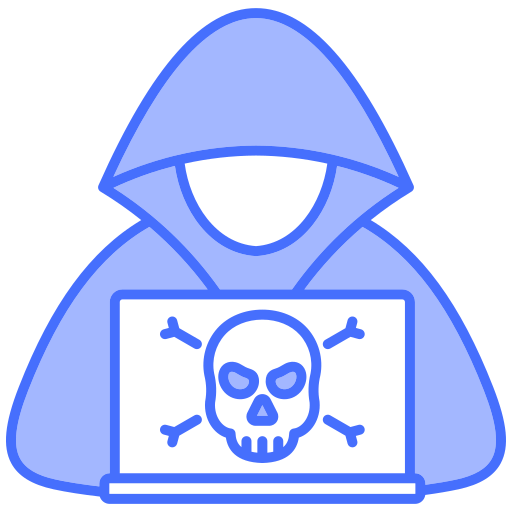

# README

<figure><figcaption></figcaption></figure>

## &#x20; About Me &#x20;

> **"Learn. Break. Defend. Document. Repeat."**

Hi, I'm **Muhammad Ihtisham Riaz**, a Cyber Security enthusiast passionate about offensive security, digital forensics, cloud security, AI security, and continuous learning.

This GitBook serves as my **personal knowledge repository**, where I document everything I learn throughout my cybersecurity journey. Rather than keeping notes scattered across notebooks and applications, I maintain this living documentation so that every lab, challenge, and lesson contributes to long-term knowledge.

## 🎯 Purpose

The goal of this knowledge base is simple:

* 📚 Document everything I learn
* 🔬 Share practical research
* 🛡️ Improve my cybersecurity skills
* 🤝 Help other learners
* 🚀 Build a reference library for future projects

As the saying goes:

> _"The weakest memory is stronger when written down."_

## 📖 What You'll Find Here

### 🔴 Penetration Testing

* Web Application Security
* Network Penetration Testing
* Active Directory
* Internal Assessments
* External Assessments
* Wireless Security
* API Security
* Cloud Security

### ⚔️ Red Teaming

* Adversary Simulation
* Command & Control
* OPSEC
* Initial Access
* Privilege Escalation
* Lateral Movement
* Persistence
* Defense Evasion

### 🔵 Blue Team

* Detection Engineering
* Incident Response
* Threat Hunting
* SIEM
* Log Analysis
* Digital Forensics
* Malware Analysis

### 🤖 AI Security

* AI Red Teaming
* LLM Security
* Prompt Injection
* MCP Security
* Agent Security
* AI Threat Modeling

### ☁️ Cloud Security

* AWS
* Azure
* GCP
* IAM
* Kubernetes
* Docker

### 🏴 Capture The Flag (CTF)

Writeups from:

* Hack The Box
* TryHackMe
* PortSwigger Labs
* PicoCTF
* VulnHub
* Custom Labs

### 📝 Certifications

Preparation notes and checklists for:

* CRTA
* MCRT
* CC By ISC
* Hackviser CORE

### 🧪 Labs

Practical walkthroughs covering:

* Enumeration
* Exploitation
* Post Exploitation
* Privilege Escalation
* Active Directory Labs
* Cloud Labs

### 📋 Checklists

Collection of practical checklists including:

* Web Pentest Checklist
* API Testing Checklist
* Active Directory Checklist
* Linux Privilege Escalation
* Windows Privilege Escalation
* Bug Bounty Methodology
* Internal Network Testing
* Reporting Checklist

### 📂 Research Notes

Topics include:

* Security Research
* CVEs
* Threat Intelligence
* Emerging Technologies
* AI Security
* Cloud Security
* Research Papers

## 🎯 Philosophy

This GitBook focuses on:

* Learning by doing
* Hands-on labs
* Practical methodologies
* Structured documentation
* Continuous improvement

I believe that documenting knowledge is one of the best ways to reinforce learning while contributing to the cybersecurity community.

## 📈 Current Focus

* Offensive Security
* Active Directory
* AI Security
* Cloud Security
* Detection Engineering
* Security Automation
* Threat Hunting
* Research

## ⚠️ Disclaimer

All content published here is intended **solely for educational purposes**. Labs, demonstrations, and techniques are performed only in authorized environments such as Capture The Flag platforms, training labs, or systems where explicit permission has been granted.

Never use this information against systems without proper authorization.

## 🌱 This is a Living Knowledge Base

This GitBook is continuously updated as I explore new technologies, complete labs, study for certifications, conduct research, and gain practical experience.

Expect frequent additions, revisions, and improvements.

## 🤝 Contributions

If you discover an error, have suggestions for improvement, or would like to discuss cybersecurity topics, feel free to open an issue or connect with me.

Constructive feedback is always welcome.

## 📚 Keep Learning

> **"Knowledge grows when shared."**

Happy Learning!

